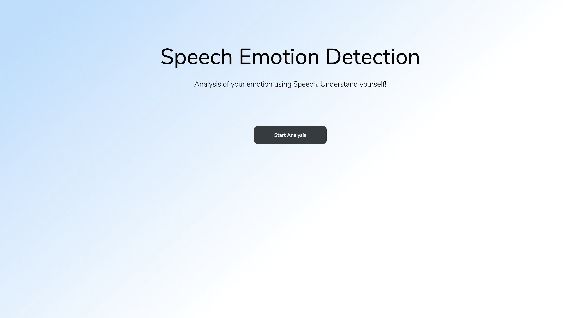
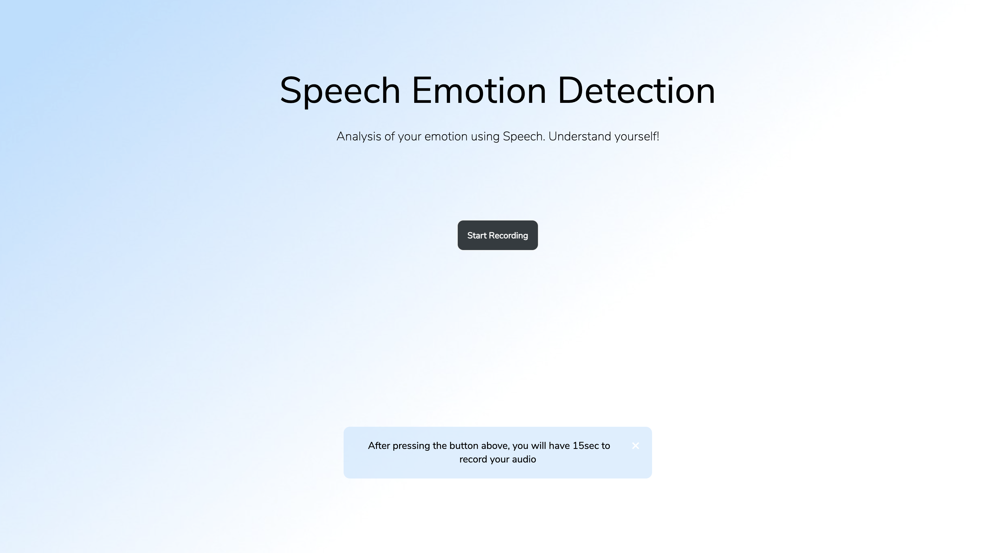
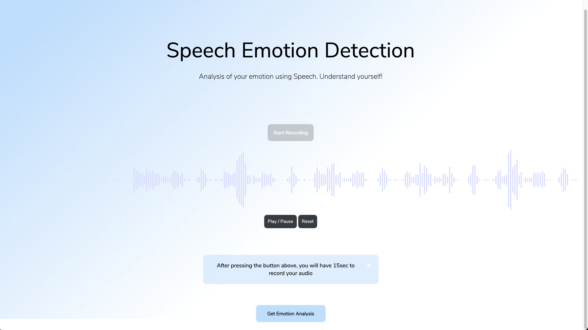
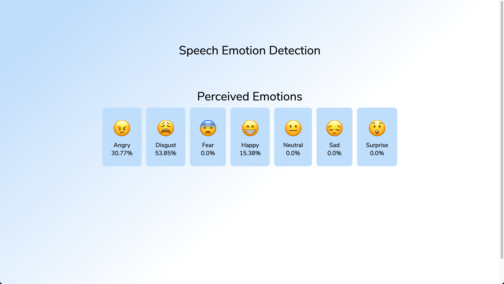

# Speech Emotion Detection

This was a final year project based on Speech Emotion Recognition(SER) Systems


## Run Locally

Clone the project

```bash
  git clone https://github.com/restacksyj/speech-emotion-detection
```

Install all dependencies

```bash
  pip install -r requirements.txt
```


Start the server

```bash
  python main.py
```

  
## Demo
The app is deployed on Heroku.

[Speech Emotion Detection](https://emotion-speech-app.herokuapp.com/ "Speech Recognition App")

  
## Screenshots
 





  